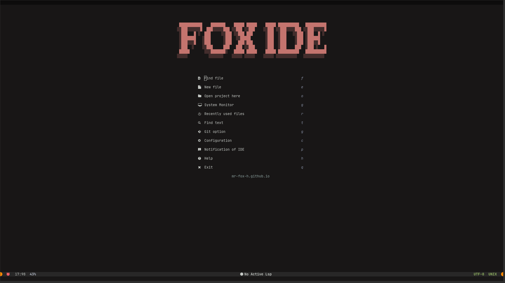
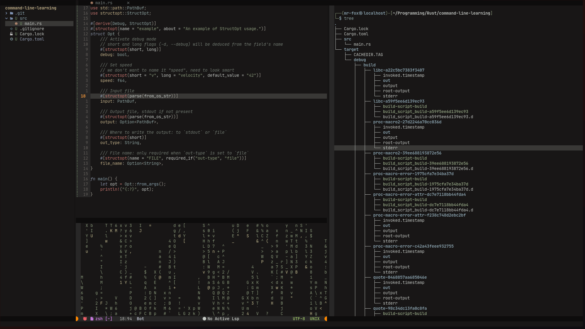
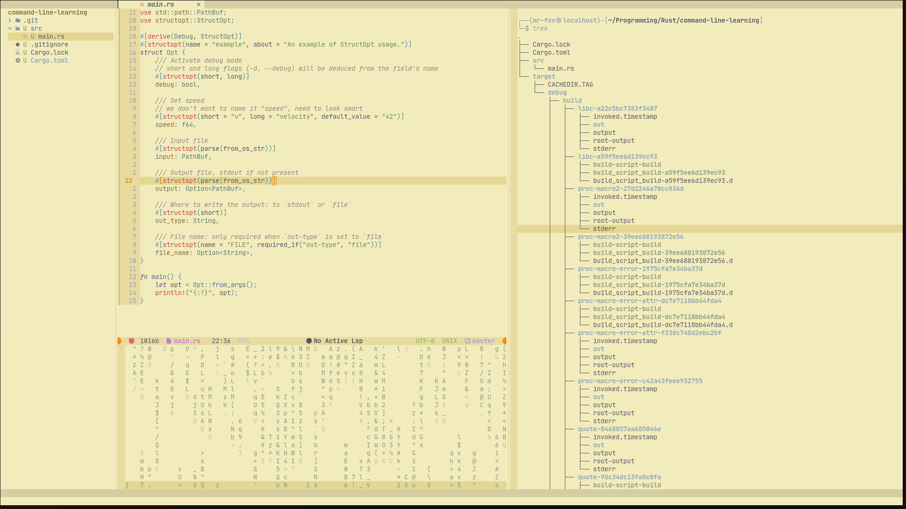
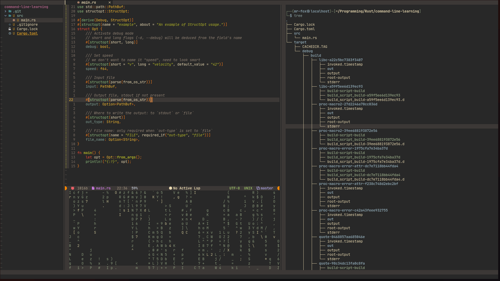
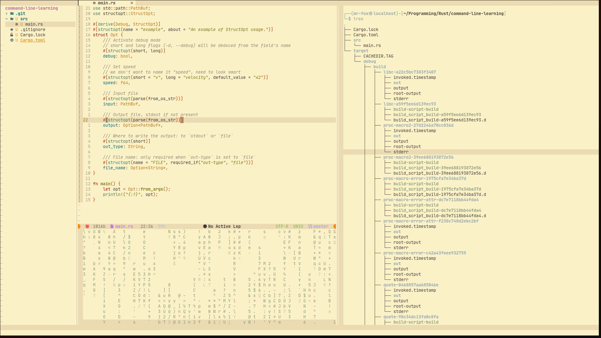
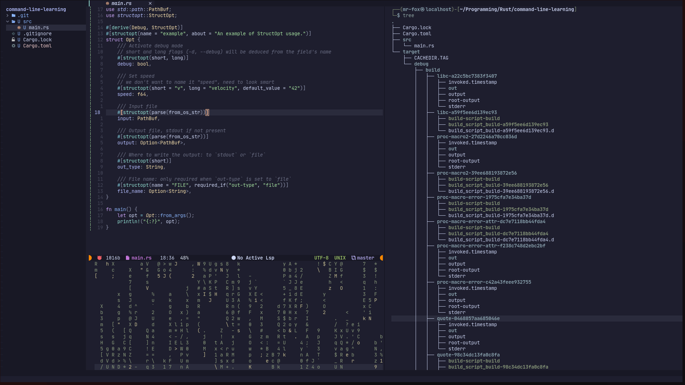
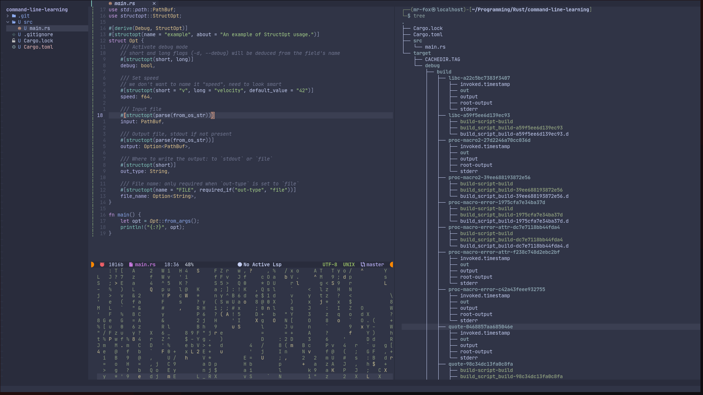
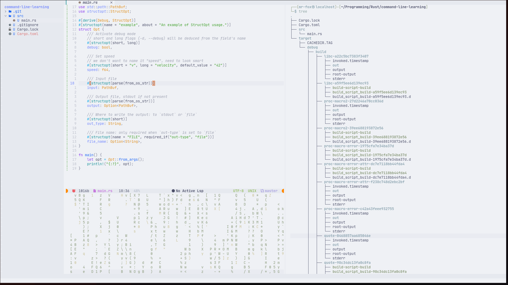
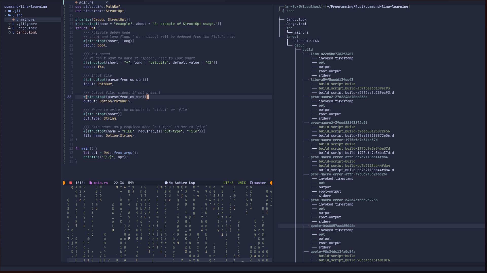
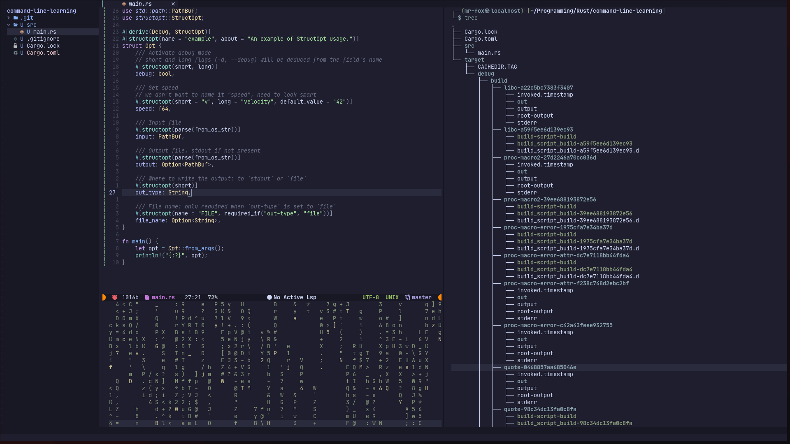

<h1 align="center">FOX IDE</h1>
<div align="center">
	<a href="https://mr-fox-h.github.io">Home</a>
  <span> | </span>
  <a href="https://github.com/Mr-Fox-h/fox-ide#install">Install</a>
  <span> | </span>
	<a href="href="https://github.com/Mr-Fox-h/fox-ide#support">Support</a>
  <p></p>
</div> 

<div align="center">

 
[](https://github.com/neovim/neovim)
[](https://github.com/Mr-Fox-h/fox-ide/issues)

</div>

## Showcase



## What is Fox IDE?

__Fox IDE__ is a simple IDE create with Neovim config and written in Lua. The goal of that to increase your speed of writing and more customizable.

## Themes

### Kangawa





### Gruvbox




### Catppuccin







## Plugins

This IDE have some cool Lua plugins such as:
- [kanagawa](https://github.com/rebelot/kanagawa.nvim)
- [gruvbox](https://github.com/ellisonleao/gruvbox.nvim)
- [catppuccin](https://github.com/catppuccin/nvim)
- [nvim-cmp](https://github.com/hrsh7th/nvim-cmp)
- [nvim-web-devicons](https://github.com/nvim-tree/nvim-web-devicons)
- [nvim-tree.lua](https://github.com/nvim-tree/nvim-tree.lua)
- [bufferline](https://github.com/akinsho/bufferline.nvim)
- [vim-bbye](https://github.com/moll/vim-bbye)
- [toggleterm](https://github.com/akinsho/toggleterm.nvim)
- [alpha-nvim](https://github.com/goolord/alpha-nvim)
- [lualine](https://github.com/nvim-lualine/lualine.nvim)
- [nvim-autopairs](https://github.com/windwp/nvim-autopairs)
- [gitsigns](https://github.com/lewis6991/gitsigns.nvim)
- [nvim-notify](https://github.com/rcarriga/nvim-notify)
- [sniprun](https://github.com/michaelb/sniprun)
- [color-picker](https://github.com/ziontee113/color-picker.nvim)
- [cheatsheet](https://github.com/sudormrfbin/cheatsheet.nvim)
- [nvterm](https://github.com/NvChad/nvterm)
- and more

## Install

First you need to install Neovim (Version 0.8.3 or last version of Neovim) on your computer. For Linux, use this command:

```
$ git clone https://github.com/Mr-Fox-h/fox-ide.git ~/.config/nvim --depth 1 && nvim
```

For Windows, use this command:

```
$ git clone https://github.com/Mr-Fox-h/fox-ide.git $HOME\AppData\Local\nvim --depth 1 && nvim
```

Then, open Neovim and use this command:

```
:PackerUpdate
```

## Uninstall

Linux / Mac (Unix):
``` 
rm -rf ~/.config/nvim
rm -rf ~/.local/share/nvim
```

Windows:

```
rd -r ~\AppData\Local\nvim
rd -r ~\AppData\Local\nvim-data
```

## Short Story

I used to use VScode with vim extension. The VScode was good, but not perfect for me! because I install vim extension on VScode to write code without using silly mouse Or touchpad; In VScode you always need mouse or touchpad, and it was make me slow, and The VScode always try to kill my Memory, so I decide to create my own IDE with Vim editor, but Vim is too old, os I used Neovim.

## Support

If you like __Fox IDE__ and would like to support & appreciate it via donation then I'll gladly accept it. 💰

BTC Address: __115mSQyzNfmYsk9MpZHHcy6KNYHUmhNuaw__

ETH Address: __0x9a3de7016d69114858b27dbc7eda95d9cf4fec3c__

SOL Address: __2xy5Jipa8iA32b6aGGqP664JhdbdcasYGTz3Frk5JQiP__

TRX Address: __TKRKXCejSw5Z4UL5u5nQqzQB9bk4eVbsPt__

<div align="center">

  
  
  
  

</div>

## Version

Version 0.5.2
